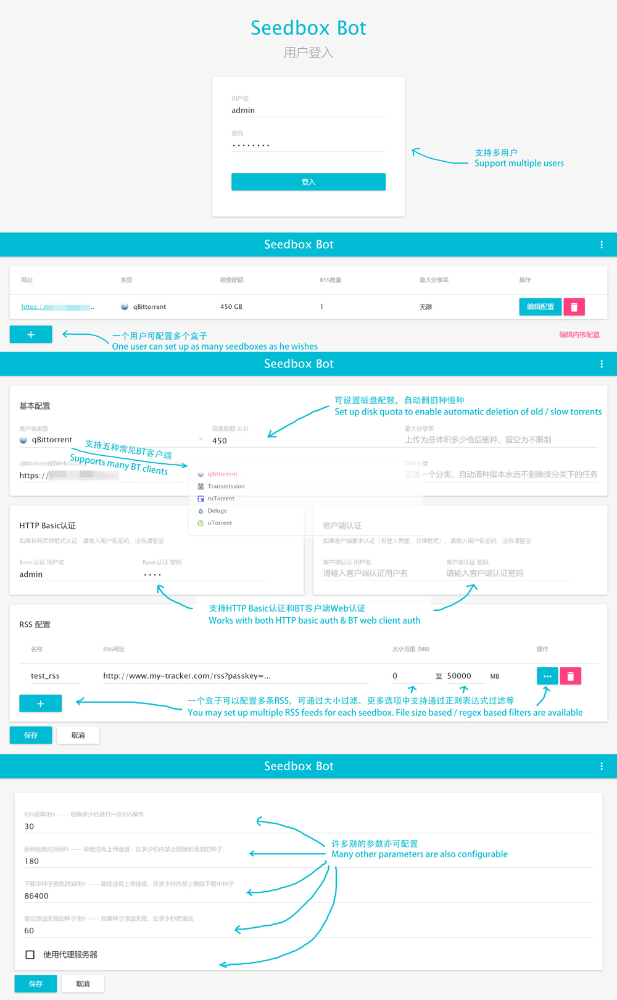

seedbox-bot  
=============================

Seedbox automation bot, featuring rss and auto deletion. Compatible with multiple WebUIs. Supports multiple user.

自动化的PT盒子管理工具，支持RSS下载和自动删种。支持多种BT客户端的WebUI，支持多用户模式。




# Installation / 安装指南

```bash
docker run -d -p10120:10120 --name seedbox-bot kevinwang15/seedbox-bot:amd64
# other architectures are also available (change docker image tag): amd64, arm32v7, arm64v8
# if you are in china, use registry.cn-hangzhou.aliyuncs.com/kevinwang15/seedbox-bot:[architecture] for better speed

# add a new user
docker exec -it seedbox-bot ./server/scripts/create-user.js

# view logs 
docker logs seedbox-bot --follow

# export configs
docker exec -it seedbox-bot ./server/scripts/export-config.js

# import configs
docker exec -it seedbox-bot ./server/scripts/import-config.js

```

# Works on / 兼容

* Any Windows / Linux System with NodeJS support. 所有支持NodeJS的Windows、Linux操作系统

* [Vultr](https://www.vultr.com/?ref=6886995) $2.5/mo VPS. Vultr 2.5美金一个月的VPS

* [Raspberry Pi](./raspberry_pi_guide.md). 树莓派

# Notes / 注意事项

1. Memory consumption of this program is about 200MB, while CPU consumption is negligible. 本程序内存消耗大约200MB，CPU消耗很低可以忽略不计。
2. Though the program provides multple user support, you should use it with caution, because accessing RSS with different passkeys may result in a ban. (consult PT admins first). 尽管本程序提供多用户支持，请务必小心，因为如果访问RSS时使用了不同的passkey，可能会被判定为小号，请先咨询PT管理员。

# English version

Currently there is only a Chinese version, i18n coming soon!

Please use Google translate for now..

If you like this project please star it, PRs are welcome!
